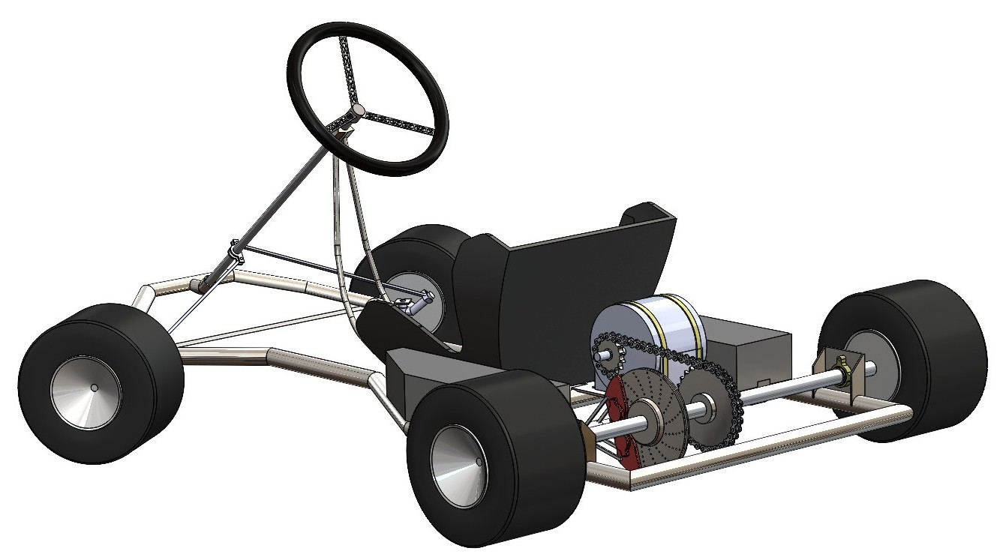
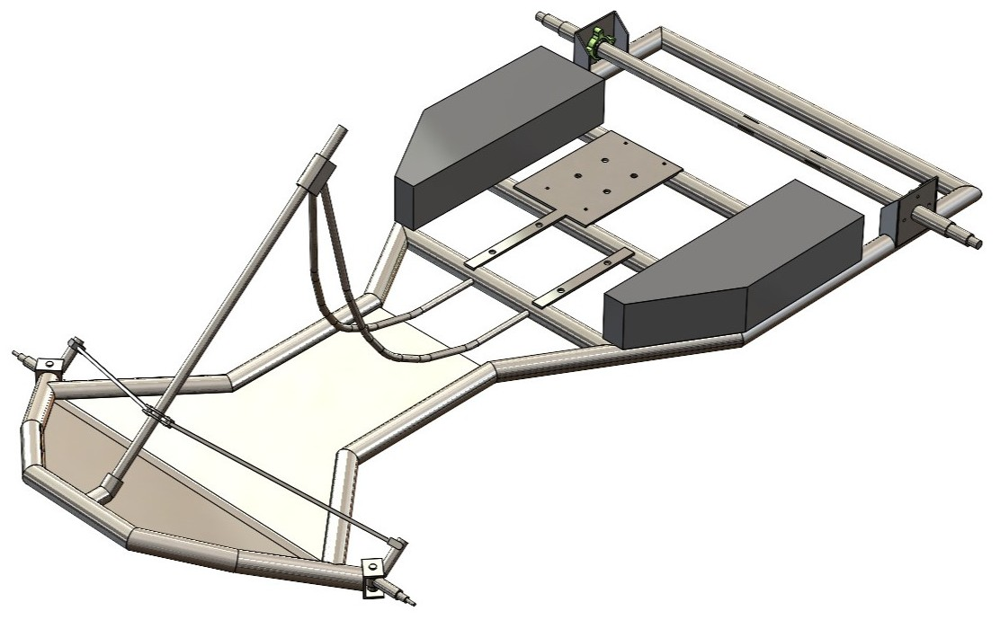
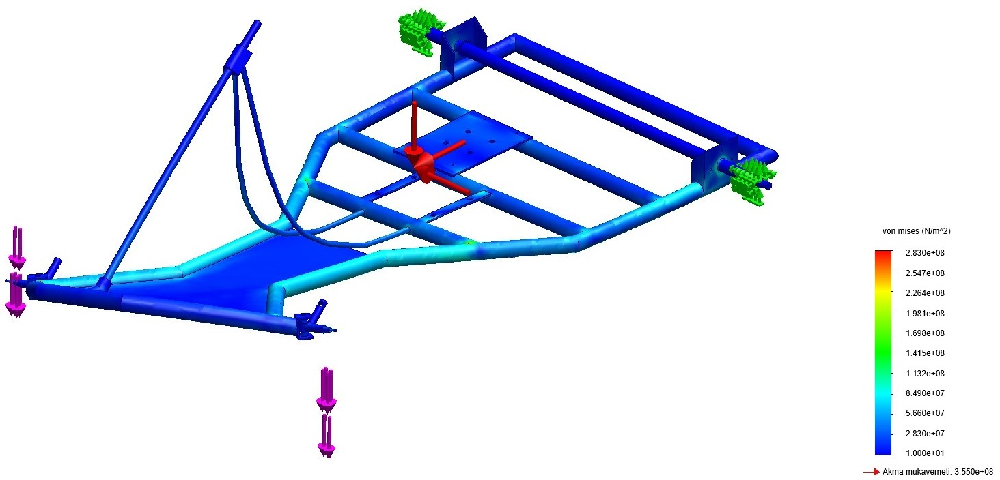
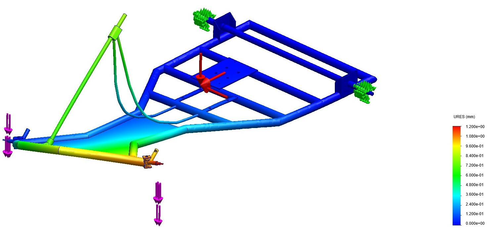

# Electric Go-Kart Chassis Design & Structural Optimization 🏎️⚡

This repository contains the conceptual design, mechanical engineering calculations, and Finite Element Analysis (FEA) of a handling-oriented electric go-kart chassis. 

## 🎯 Project Overview
Unlike standard automobiles, go-karts lack a suspension system. This requires the chassis itself to act as the suspension. This project focuses on optimizing the torsional rigidity of the chassis to successfully achieve the **"jacking effect"** (lifting the inner rear wheel during cornering) to prevent understeer, effectively compensating for the added weight of an EV battery pack.

## ⚙️ Technical Specifications
* **Chassis Material:** S355 Structural Steel Tubing (32x2mm for main rails, 25x2mm for supports)
* **Powertrain:** 1.7 kW 48V Brushless DC (BLDC) Motor
* **Energy Storage:** 14S10P Li-Ion Battery Pack (18650 NMC cells, ~1.5 kWh) managed by a 60A BMS
* **Top Speed:** ~60 km/h (Optimized via 3.69 gear ratio)
* **Wheelbase / Track Width:** 1160 mm / 1400 mm

## 🔬 Engineering Methodology & Analysis
All design and simulation phases were executed using **SolidWorks 2024**. The engineering workflow includes:

1. **Vehicle Dynamics:** Quasi-Static Load Transfer calculations to determine cornering forces and theoretical load shifts.
2. **Global FEA (Beam Elements):** Initial displacement and rigidity tests under dynamic cornering loads (up to 550N lateral shock).
3. **Sub-Modeling (Solid Elements):** High-stress regions, particularly the steering knuckle connections (stub axles), were isolated and detailed using sub-modeling techniques. 
   * *Result:* Max Von Mises stress of **283 MPa** (Safely below the 355 MPa yield limit of S355 steel).
4. **Fatigue Analysis:** The 25mm rear axle was verified for infinite life under dynamic loads using the **Soderberg Criterion**.
5. **Stability:** Buckling analysis confirmed a critical load factor of 1.6.

## 📂 Repository Structure
* `/CAD_Models`: Contains SolidWorks native parts/assemblies (.sldprt, .sldasm) and exported .STEP files for universal access.
* `/Results_and_Images`: High-resolution CAD renders and FEA stress distribution contour plots.
* `/Documentations`: The comprehensive engineering design report (in Turkish) detailing all mathematical models, material selection, and cost analysis.

---
*Designed by Erdoğan Kır as a senior Mechatronics Engineering design project.*
NON-COMMERCIAL USE ONLY

---
# Elektrikli Go-Kart Şasi Tasarımı ve Yapısal Optimizasyonu 🏎️⚡

Bu depo, yol tutuş odaklı bir elektrikli go-kart şasisinin kavramsal tasarımını, makine mühendisliği hesaplamalarını ve Sonlu Elemanlar Analizi'ni (FEA) içermektedir.

## 🎯 Proje Özeti
Standart otomobillerden farklı olarak, go-kartlar bir süspansiyon sistemine sahip değildir. Bu durum, şasinin kendisinin bir süspansiyon elemanı gibi davranmasını zorunlu kılar. Bu proje, elektrikli araç batarya paketinin ek ağırlığını telafi ederek önden kaymayı (understeer) önlemek ve viraj dönüşlerinde iç arka tekerleği kaldırmak olan **"jacking effect"** (kaldırma etkisi) mekanizmasını başarıyla sağlamak için şasinin burulma rijitliğini optimize etmeye odaklanmaktadır.

## ⚙️ Teknik Özellikler
* Şasi Malzemesi:** S355 Yapı Çeliği Boru (Ana kollar için 32x2mm, destekler için 25x2mm) 
* **Güç Aktarma Sistemi:** 1.7 kW 48V Fırçasız DC (BLDC) Motor 
* Enerji Depolama:** 60A BMS ile yönetilen 14S10P Li-İyon Batarya Paketi (18650 NMC hücreler, ~1.5 kWh) 
* **Maksimum Hız:** ~60 km/s (3.69 dişli oranı ile optimize edilmiştir) 
* **Aks Aralığı / İz Genişliği:** 1160 mm / 1400 mm 

## 🔬 Mühendislik Metodolojisi ve Analiz
Tüm tasarım ve simülasyon aşamaları **SolidWorks 2024** kullanılarak gerçekleştirilmiştir. Mühendislik iş akışı şunları içerir:

1. **Araç Dinamiği:** Viraj kuvvetlerini ve teorik yük transferlerini belirlemek için Yarı-Statik Yük Transferi hesaplamaları.
2. **Global FEA (Kiriş Elemanlar):** Dinamik viraj yükleri altında (550N'a kadar yanal şok) ilk yer değiştirme ve rijitlik testleri.
3. **Alt Modelleme (Katı Elemanlar):** Özellikle direksiyon mafsal bağlantıları (stub axles) gibi yüksek gerilme bölgeleri izole edilmiş ve alt modelleme teknikleri kullanılarak detaylandırılmıştır.
   * *Sonuç:* Maksimum Von Mises gerilmesi **283 MPa** (S355 çeliğinin 355 MPa akma sınırının güvenli bir şekilde altındadır).
4. **Yorulma Analizi:** 25mm arka aks milinin dinamik yükler altındaki sonsuz ömrü **Soderberg Kriteri** kullanılarak doğrulanmıştır.
5. **Stabilite:** Burkulma analizi (buckling) 1.6'lık kritik yük faktörünü doğrulamıştır.

## 📂 Depo Yapısı
* `/CAD_Models`: SolidWorks yerel parça/montaj dosyalarını (.sldprt, .sldasm) ve evrensel erişim için dışa aktarılmış .STEP dosyalarını içerir.
* `/Results_and_Images`: Yüksek çözünürlüklü CAD render'larını ve FEA gerilme dağılımı haritalarını içerir.
* `/Documentations`: Tüm matematiksel modelleri, malzeme seçimini ve maliyet analizini detaylandıran kapsamlı mühendislik tasarım raporu.

---
*Mekatronik Mühendisliği tasarım projesi olarak Erdoğan Kır tarafından tasarlanmıştır.* 

SADECE TİCARİ OLMAYAN KULLANIM İÇİNDİR
